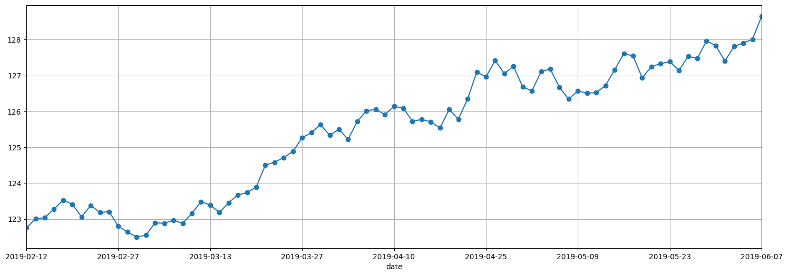
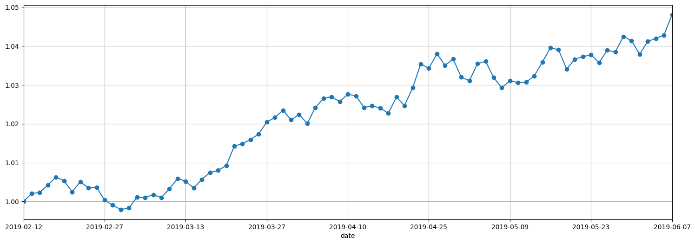

# portfolio-tool
This is a simple tool to compute daily closed price with currency impact for your portfolio. The daily stock price and currency exchange rate are from [Alpha Vantage](https://www.alphavantage.co/) [API](https://www.alphavantage.co/documentation/).

## Environment Setup
1. Install python3 using `pyenv`

   1. Follow these instructions for `pyenv` [installation](https://github.com/pyenv/pyenv#installation) or use `pyenv` [automatic installer](https://github.com/pyenv/pyenv-installer).

   1. Install python 3.7.3:

          $ pyenv install 3.7.3

2. Install `pipenv`

   1. Clone this repository and go to the repository root folder:

          $ git clone git@github.com:hongshibao/portfolio-tool.git
          $ cd portfolio-tool

   2. Make sure it will run python 3.7.3 in this repository:

          $ python --version

      It should output `Python 3.7.3`. If not, please check whether `pyenv` installation is complete.

   3. Use `pip` to install `pipenv`:

          $ pip install pipenv

3. Install package dependencies using `pipenv`

        $ pipenv install

   It will also create a virtual environment dedicated to this repository.

4. Activate the virtual environment

        $ pipenv shell

## Usage
Run --help to get usage and arguments:

    $ python portfolio/app.py --help

```
Usage: app.py [OPTIONS]

Options:
  --data-api-key TEXT        Alpha Vantage API key
  --enable-api-rate-control  Enable API rate limit control
  --csv-filepath TEXT        The portfolio CSV file
  --to-currency TEXT         Destination currency for the portfolio
  --num-days INTEGER         The number of days for latest portfolio price
                             data
  --fig-filepath TEXT        The path and file name for time series figure
                             output
  --price-scaling            Do price scaling
  --help                     Show this message and exit.
```

Free Alpha Vantage API key can be claimed [here](https://www.alphavantage.co/support/#api-key). But there is API rate limit for free API keys. Argument *--enable-api-rate-control* can enable API rate control to make sure it will not reach the Alpha Vantage API rate limit.

The portfolio CSV has 3 columns: *symbol*, *currency*, and *weight*. Here is an example portfolio CSV data:
```
symbol,currency,weight
XLP,USD,0.033
XLY,USD,0.148
CWB,USD,0.148
FEZ,USD,0.031
AAXJ,USD,0.070
GLD,USD,0.104
VGIT,USD,0.141
TLT,USD,0.119
TIP,USD,0.148
TLH,USD,0.048
```
The list of available physical currency can be downloaded [here](https://www.alphavantage.co/physical_currency_list/).

Example output without price scaling:



Example output with price scaling:


